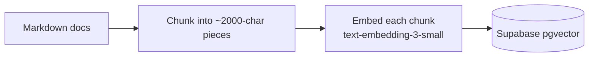
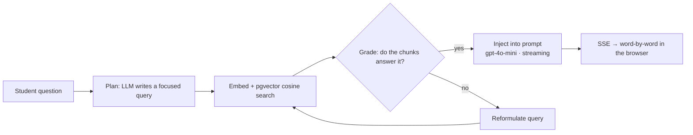

# Jack — ICL Lab Assistant

> A production RAG assistant that guides complete beginners through makerspace equipment, step by step — even when no instructor is around.


**Jack** is an AI assistant built for the Innovation & Creativity Lab (ICL) at Gettysburg College. Students ask a question in plain English — *"how do I 3D print a phone stand?"* — and Jack walks them through the real lab procedure, one step at a time, with inline photos and videos of the actual equipment.

It is **not a ChatGPT wrapper.** Every answer is grounded in a custom knowledge base of ICL-specific documentation through an agentic Retrieval-Augmented Generation (RAG) pipeline — so Jack answers from the lab's actual procedures and says "I don't have that yet" instead of hallucinating when it doesn't know.

It is named after Clarence B. "Jack" Rogers Jr. (Class of 1951), the Gettysburg College alumnus whose philanthropy made the lab possible.

---

## Features

- **Agentic retrieval** — Jack plans its own search query from the conversation, grades whether the retrieved chunks actually answer it, and reformulates with a fresh search if they fall short, then generates a grounded answer
- **Grounded RAG answers** — responses come only from the ICL knowledge base, not the model's training data
- **Two guide modes** — a full walkthrough all at once, or one step at a time at the student's pace
- **Inline media** — videos and photos of the real lab equipment render directly inside the steps
- **Conversation memory** — students can ask follow-up questions mid-process and Jack stays in context
- **Voice input** — ask by speaking, for kiosk and touchscreen use
- **Save as PDF** — export a full guide as a printable sheet to take to the machine
- **Intent classification** — detects when a vague request should branch into a guided walkthrough
- **Feedback logging** — 👍/👎 on each answer, stored for measuring real-world helpfulness
- **Automated evaluation** — a property-based harness (`eval.mjs`) fires real scenarios through the pipeline and checks grounding, refusal, and step-continuation behavior
- **Hardened endpoints** — per-IP rate limiting, request-size caps, and path-traversal protection
- **Streaming responses** — answers stream in word-by-word over Server-Sent Events

---

## How it works

Jack runs a two-phase RAG pipeline.

**Phase 1 — Ingestion** (`ingest.js`, run once when docs change):



**Phase 2 — Agentic retrieval** (`server.js`, every student message):

Rather than blindly embedding the raw message, an agent decides *what* to search for, checks whether the results are good enough, and self-corrects before answering:



- **Plan** — an LLM turns the conversation into one focused query, so a bare *"next"* mid-walkthrough becomes *"slicing a model in Cura"* instead of a meaningless search.
- **Grade** — a second LLM call judges whether the retrieved chunks actually cover the query.
- **Correct** — if they miss, the agent reformulates and searches again; if retrieval still comes up empty, Jack says it doesn't know rather than inventing an answer.

The knowledge base is plain Markdown, so adding a new machine is just writing a new doc and re-running ingestion — no code changes. Media is embedded with simple `[VIDEO: url | title]` and `[IMAGE: url | caption]` tags that the frontend renders into players and images.

---

## Evaluation

LLM output is non-deterministic, so `eval.mjs` tests **properties** of the responses rather than exact strings. It fires a fixed set of scenarios through the live pipeline and checks each one:

- **Grounding / refusal** — out-of-domain questions are declined, not hallucinated
- **Step continuation** — a mid-walkthrough *"next"* advances to the correct step
- **Troubleshooting, FAQ, safety, identity** — the right information surfaces

```bash
npm start          # in one terminal
node eval.mjs      # in another → prints a PASS/FAIL report
```

Current suite: **12/12 passing**, with per-case latency reported.

---

## Tech stack

| Layer | Choice |
|-------|--------|
| Backend | Node.js (raw `http` module, no framework) |
| LLM | OpenAI `gpt-4o-mini` |
| Embeddings | OpenAI `text-embedding-3-small` (1536-dim) |
| Vector store | Supabase Postgres + `pgvector` (cosine similarity) |
| Frontend | Vanilla JS, custom CSS, Server-Sent Events |
| Hosting | Railway (persistent server, no cold starts) |

---

## Project structure

```
server.js                # backend: agentic RAG pipeline, streaming, API endpoints
client.js                # frontend: chat UI, guide modes, media rendering
index.html / styles.css  # the interface
ingest.js                # builds the vector knowledge base from Markdown
eval.mjs                 # automated evaluation harness (property-based tests)
knowledge_base/          # the ICL documentation (one Markdown file per topic)
```

---

## Running locally

```bash
# 1. Install dependencies
npm install

# 2. Add a .env file with your keys
#    SUPABASE_URL=...
#    SUPABASE_SECRET_KEY=...
#    OPENAI_API_KEY=...

# 3. Build the knowledge base (embeds the Markdown docs into Supabase)
node ingest.js

# 4. Start the server
npm start          # → http://localhost:3000

# 5. (optional) Run the evaluation harness against it
node eval.mjs
```

A Supabase table `knowledge_chunks` with a `match_knowledge_chunks` similarity RPC is required (pgvector).

---

## Roadmap

- Expand the knowledge base to more machines (embroidery, laser cutter, vinyl cutter)
- Real lab photos and instructional videos for every step
- A source side-panel so students can open the original document beside a step
- Floating desktop widget + kiosk mode for the lab computers
- Photo upload so students can show Jack a problem and get a diagnosis

---

## About

Built by Ashim Aryal for the Rogers Center for Innovation & Creativity at Gettysburg College.
