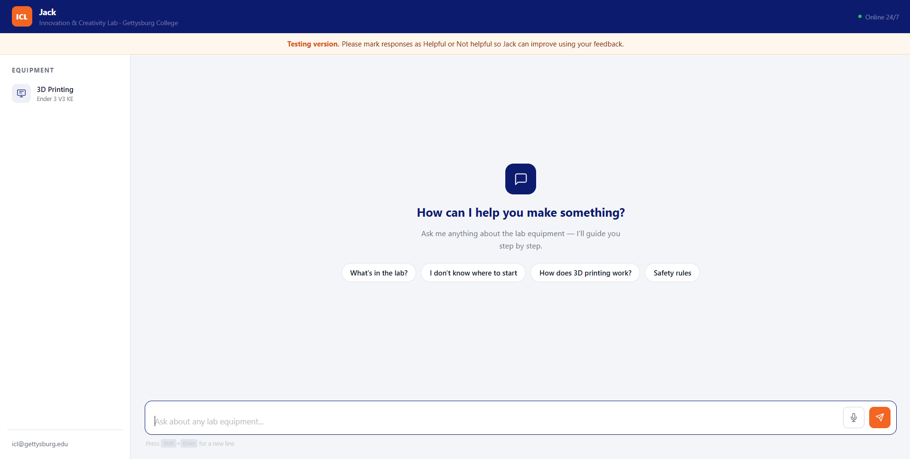
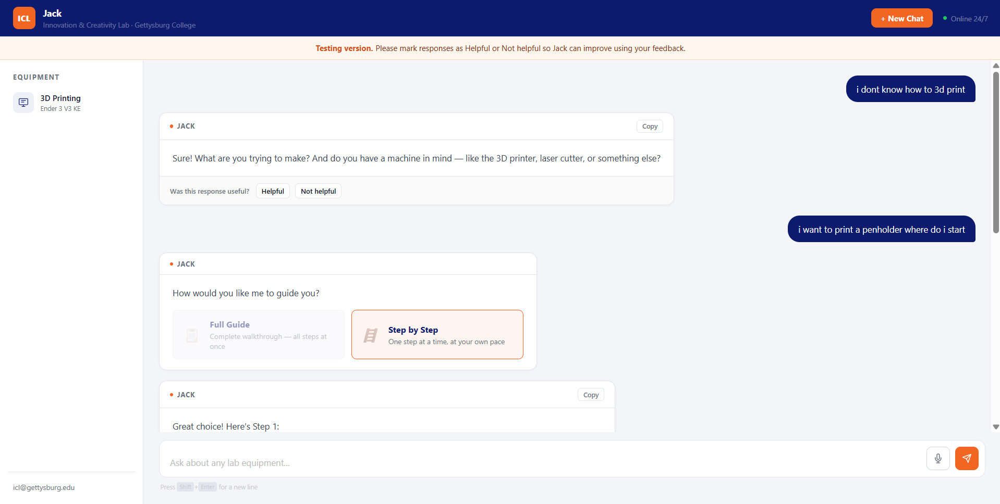
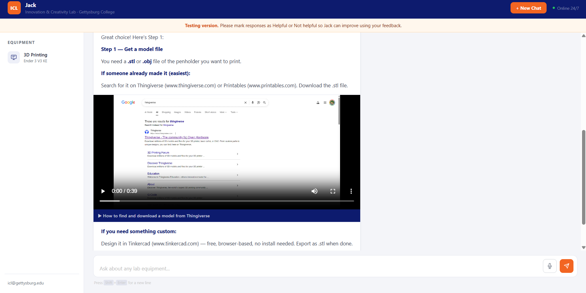
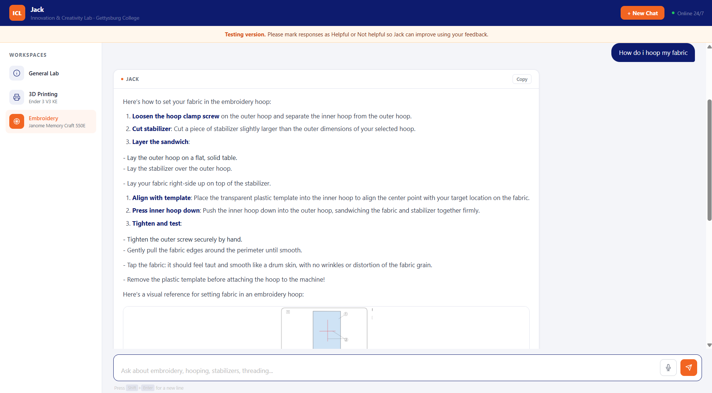
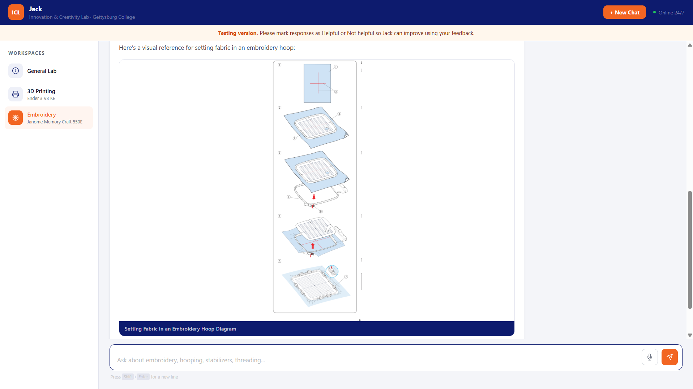
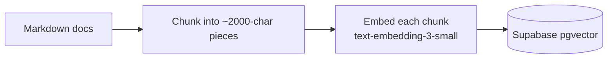

# Jack: Makerspace AI Assistant

> A RAG assistant that rewrites the student's question, retrieves from lab docs, and walks them through makerspace equipment step by step.

**Jack** is an independent project I built to help students use makerspace equipment on their own. Students ask a question in plain English (*"how do I 3D print a phone stand?"*) and Jack walks them through the real lab procedure, one step at a time, with inline photos and videos of the actual equipment.

Every answer is grounded in a custom knowledge base of ICL-specific documentation. Jack does not treat the raw chat message as the search query. It first turns the conversation into a focused retrieval question, then looks that up in the lab docs, then answers from those chunks. If the docs do not cover it, it says so instead of guessing.

It is named after Clarence B. "Jack" Rogers Jr. (Class of 1951), the Gettysburg College alumnus whose philanthropy made the lab possible.

> **Current scope:** Jack supports the lab's 3D printing (Ender 3 V3 KE) today. Support for the ICL's other machines is on the roadmap.

---

## Demo

Jack organizes the lab into workspaces: a universal **General Lab** plus a focused tab per machine. A plain-English question becomes real lab steps with inline photos, videos, and diagrams.

| Explore the lab | Choose how to be guided | Follow steps, with video |
|:---:|:---:|:---:|
|  |  |  |

| Dedicated Embroidery workspace | High-resolution machine diagrams |
|:---:|:---:|
|  |  |

A vague request (*"i dont know how to 3d print"*) is caught by intent classification, branched into a guided walkthrough, and answered one step at a time. Each machine has its own focused workspace. Answers render the actual ICL equipment (videos, photos, and manual diagrams) inline where the step needs them.

---

## Features

- **Query rewriting:** before search, the recent conversation is rewritten into one retrieval question (machine, step, tool)
- **Grounded RAG answers:** responses come only from the ICL knowledge base, not the model's training data
- **Two guide modes:** a full walkthrough all at once, or one step at a time at the student's pace
- **Inline media:** videos and photos of the real lab equipment render directly inside the steps
- **Conversation memory:** students can ask follow-up questions mid-process and Jack stays in context
- **Voice input:** ask by speaking, for kiosk and touchscreen use
- **Save as PDF:** export a full guide as a printable sheet to take to the machine
- **Intent classification:** detects when a vague request should branch into a guided walkthrough
- **Feedback logging:** 👍/👎 on each answer, stored for measuring real-world helpfulness
- **Hardened endpoints:** per-IP rate limiting, request-size caps, and path-traversal protection
- **Streaming responses:** answers stream in word-by-word over Server-Sent Events

---

## How it works

**Phase 1: Ingestion** (run once when docs change):

```mermaid
flowchart LR
  A[Markdown docs] --> B[Chunk into ~2000-char pieces]
  B --> C[Embed each chunk<br/>text-embedding-3-small]
  C --> D[(Supabase pgvector)]
```

**Phase 2: Query** (every student message):

```mermaid
flowchart LR
  A[Student message] --> B[Keep last real question<br/>if they said next/ok]
  B --> C[Rewrite into a retrieval query]
  C --> D[Embed that query]
  D --> E[pgvector cosine search]
  E --> F[Filter by workspace]
  F --> G[Answer from those chunks]
```

1. If the student just said *next* or *ok*, retrieval uses their last real question, not the filler.
2. The conversation is sent to `gpt-4o-mini`, which writes one search query: machine + step + tool or material.
3. That rewritten query is embedded and searched in pgvector.
4. Chunks are filtered to the active workspace (general, 3D printing, or embroidery).
5. Jack answers from those chunks only. Image/video tags that were not in the retrieved docs are stripped.

Query rewriting is the `expandQuery` step in `server.js`. Set `QUERY_EXPANSION=1` to turn it on.

The knowledge base is plain Markdown, so adding a new machine is just writing a new doc and re-running ingestion. Media is embedded with simple `[VIDEO: url | title]` and `[IMAGE: url | caption]` tags that the frontend renders into players and images.

---

## Tech stack

| Layer | Choice |
|-------|--------|
| Backend | Node.js (raw `http` module, no framework) |
| LLM | OpenAI `gpt-4o-mini` |
| Embeddings | OpenAI `text-embedding-3-small` (1536-dim) |
| Vector store | Supabase Postgres + `pgvector` (cosine similarity) |
| Frontend | Vanilla JS, custom CSS, Server-Sent Events |
| Hosting | Railway (persistent server, no cold starts) |

---

## Roadmap

- Expand the knowledge base to more machines (embroidery, laser cutter, vinyl cutter)
- Real lab photos and instructional videos for every step
- A source side-panel so students can open the original document beside a step
- Floating desktop widget + kiosk mode for the lab computers
- Photo upload so students can show Jack a problem and get a diagnosis
